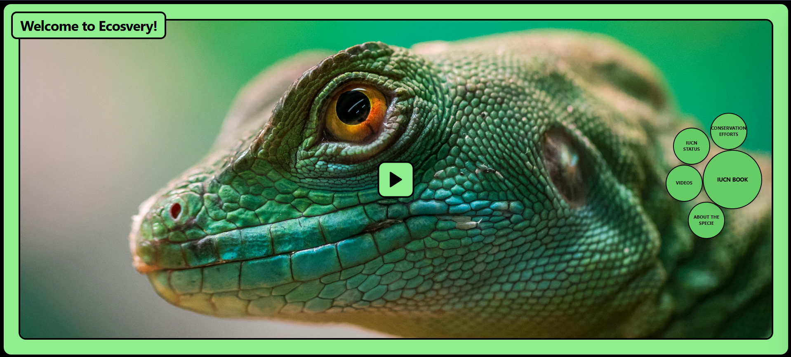

# Ecosvery 



> Bringing the IUCN Red List to life through interactive exploration

A modern web application that makes biodiversity data accessible and engaging. Browse through 38,000+ mammal species, explore their conservation status, and discover multimedia content—all powered by real-time data from the IUCN Red List API.

**Built by Abhilash** • [Live Demo](#) • [Report Bug](../../issues)

---

## Why This Project?

I've always been fascinated by wildlife conservation efforts, but I found the official IUCN database overwhelming for casual exploration. This project started as a way to make conservation data more approachable,something you could browse on a Sunday afternoon and actually learn from.


## Features
- Single-page app with state flowing through callback props
- Slide-out panels for details, no page reloads
- Mobile-responsive with dual render paths
- Batch API calls instead of hammering endpoints one by one
- SessionStorage caching with TTL—pages you've visited load instantly on return


## Tech Stack

### Core
- **React 18** + **TypeScript** 
- **Vite** - Lightning-fast dev server and builds
- **Tailwind CSS** - Utility-first styling 

### APIs & Data
- **[IUCN Red List API v4](https://apiv3.iucnredlist.org/api/v3/docs)** - Conservation assessments for 150,000+ species
- **[UniProt FTP](https://ftp.uniprot.org/)** - Common names database (38k+ entries)
- **YouTube API** - Educational videos via backend proxy
- **Animal Image API (Wikimedia Commons)** - Species photography

### Icons & UI
- **[Lucide React](https://lucide.dev/)** - Beautiful, consistent icons
- Custom components 

## Project Structure

```
src/
├── components/         
│   ├── ErrorBoundary.tsx       
│   ├── HeroSection.tsx         # Main view controller
│   ├── CollapsibleBox.tsx      # Slide-out panel router
│   ├── SpeciesList.tsx         # Paginated species browser
│   ├── SpeciesDetailView.tsx   # Tab-based detail viewer
│   ├── Navigation.tsx          # Responsive nav 
│   └── Header.tsx              
├── services/          
│   ├── iucnApi.ts             # IUCN Red List integration
│   └── uniprotSpecies.ts      # FTP parser for common names
├── utils/             
│   └── apiHelpers.ts          # Timeout, retry, caching helpers
└── App.tsx            # Root with environment validation
```

## Getting Started

### Prerequisites
- Node.js 18+ (uses `import.meta.env`)
- A Vercel backend for CORS proxying 

### Installation

```bash
# Clone the repo
git clone https://github.com/yourusername/ecosvery.git
cd ecosvery

# Install dependencies
npm install

# Set up environment variables
cp .env.example .env
# Edit .env with your backend URL
```

### Environment Variables

Create a `.env` file:

```bash
VITE_BACKEND_BASE_URL=https://your-backend.vercel.app
VITE_UNIPROT_FTP_URL=https://ftp.uniprot.org/pub/databases/uniprot/knowledgebase/complete/docs/speclist.txt
VITE_YOUTUBE_EMBED_BASE_URL=https://www.youtube.com/embed
VITE_DEFAULT_VIDEO_ID=i5_ZPMXQGKY
VITE_DEFAULT_IMAGE_URL=https://images.pexels.com/photos/927497/pexels-photo-927497.jpeg
```

> **Note**: All Vite env vars must be prefixed with `VITE_` to be exposed to the client.

### Development

```bash
npm run dev          # Start dev server → http://localhost:5173
npm run typecheck    # Run TypeScript validation
npm run build        # Production build
npm run preview      # Preview production build
```

### Performance and Reliability

**Caching Layers**  
- Page-level cache for species lists (`iucn_page_{number}`)  
- Assessment-level cache for complete details by `assessment_id`  
- Species video cache for YouTube results  
- Session-wide UniProt cache for parsed FTP data  

Each cache uses a TTL system to automatically remove stale data.  

**Optimized Batch Processing**  
Collects all scientific names in bulk and performs a single UniProt memory lookup, allowing instant retrieval of common names across full result pages.  

**Error Control**  
Implements exponential backoff retries (up to 3 attempts), 30-second request timeouts, and error boundaries that display clear diagnostic messages.


## Future Ideas

- [ ] Add more taxonomic classes (birds, reptiles, fish)
- [ ] User favorites/bookmarks (localStorage)
- [ ] Share species links (URL state management)
- [ ] Export species data as CSV


## Contributing

Found a bug? Have an idea? Open an issue or submit a PR. This is a learning project, so I'm open to suggestions and improvements.

## Acknowledgments

- **IUCN Red List** for making their API publicly accessible
- **UniProt** for the comprehensive species database
- **Tailwind team** for making CSS fun again
- **Lucide** for the clean icon set

## License

MIT © Abhilash

---

**Made with ☕ and curiosity** • Star if you learned something!
